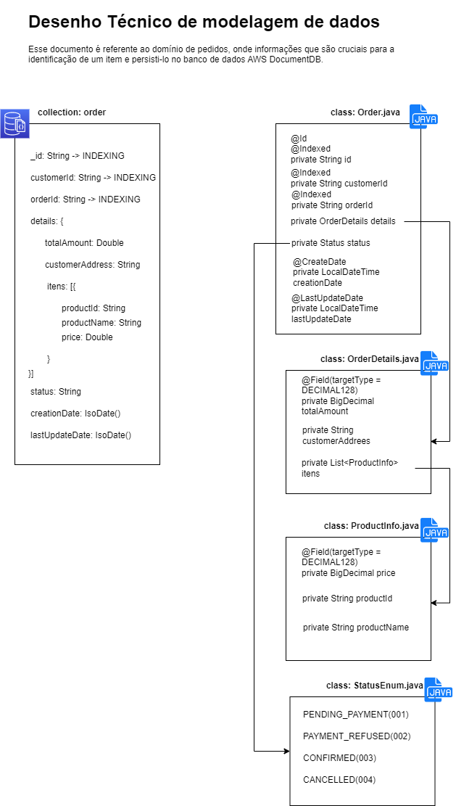

# Desafio Engenharia Software

## Projeto de integração de microsserviços

- [Introdução](#introdução)
- [Instalação](#instalaçao)
- [Arquitetura](#arquitetura)
- [Modelagem de dados](#modelagem-de-dados)
- [Casos de uso](#contributing)
- [Observabilidade](#observability)
- [Implatação na AWS](#implantaçao)

### Introdução

Esse projeto teve sua origem a partir de um processo seletivo sendo reaproveitado para a construção de um artigo-tutorial
para auxiliar a comunidade de desenvolvedores e engenheiros de software em um dos temas mais populares a atualidade no 
assunto de programação distribuída.

No código se encontra bons exemplos práticos de implantação de comunicações síncronas e assíncronas que são feitas a
partir de pods em um Cluster Kubernetes.

Além disso se encontra implementações de bancos de dados orientado a documento (DocumentDB/MongoDB) e baseados em Cachê
(Redis).

No repositório se encontram arquivos de deployments e services para a implantação das imagens geradas a partir dos Dockerfiles
dentro das pastas do Microsserviço.

Alguns links úteis:


SWAGGER funcional das APIs: http://187.104.145.57:8081

Grafana com dashboard de monitoramento das aplicações: http://187.104.145.57:3000

Repositório com as imagens geradas no DockerHub: https://hub.docker.com/repository/docker/nihbertolo97/desafio-engenharia-sofware/general

### Instalaçao

Apesar do projeto ter como objetivo ser implantado na Núvem, para efeitos didáticos foi-se criado um arquivo com comandos
shellscript para auxiliar na instalaçao da máquina local do usuário/desenvolvedor. Mas para isso é necessário alguns requisitos:

 * Docker(v4.30.1) e Kubernetes(1.24.0) instalados (versão mínima)
 * Possuir suporte para execução de shellscript (em sistemas baseados em Unix são nativos, para OS Windows é interessante instalar gitbash)

Com todos os requisitos atendidos, configure as variáveis de ambiente {MONGODB_HOST} para os arquivos *deployment.yml* dos microsserviços,
é importante setar um IP/PORTA para um MongoDB/DocumentDB com as mesmas credenciais. Caso necessário existe um script abaixo que baixa a imagem
do MongoDB e implementa em um container. E então basta indicar o IP externo da sua rede física local.

Em seguida abra o terminal na pasta raíz do projeto  e execute comando 

   ```sh
   ./deploy.sh
   ```

Após o término da execução do comando, consulte os pods gerados (total 7 pods) através do comando

   ```sh
   kubectl get pod
   ```
Depois de todos os pods estarem saudãveis, abra um port-forward apontando para o pod da aplicação *ms-bff* expondo sua porta desejada para a porta 8080

   ```sh
   kubectl port-forward <NOME_DO_POD> <SUA_PORTA>:8080
   ```

E finalmente, basta acessar o swagger da aplicação em http://127.0.0.1:8081/swagger-ui.html 

### Arquitetura

Nesse projeto foi adotada a arquitetura baseada em microsserviços, com comunicação feita tanto com gRPC e mensageria com
RabbitMQ, atraves de duas filas entre os domínios de pagamento e pedido.

Existem no total 4 dominios (cliente, pedido, pagamento e produto) e para cada domínio, um banco de dados inserido no 
cluster do Amazon DocumentDB

Segue abaixo o diagrama de arquitetura implantada no Cluster Kubernetes:


### Modelagem de dados
 
 * Domínio Cliente


 * Domínio Pedido



 * Domínio Pagamento


* Domínio Produto


